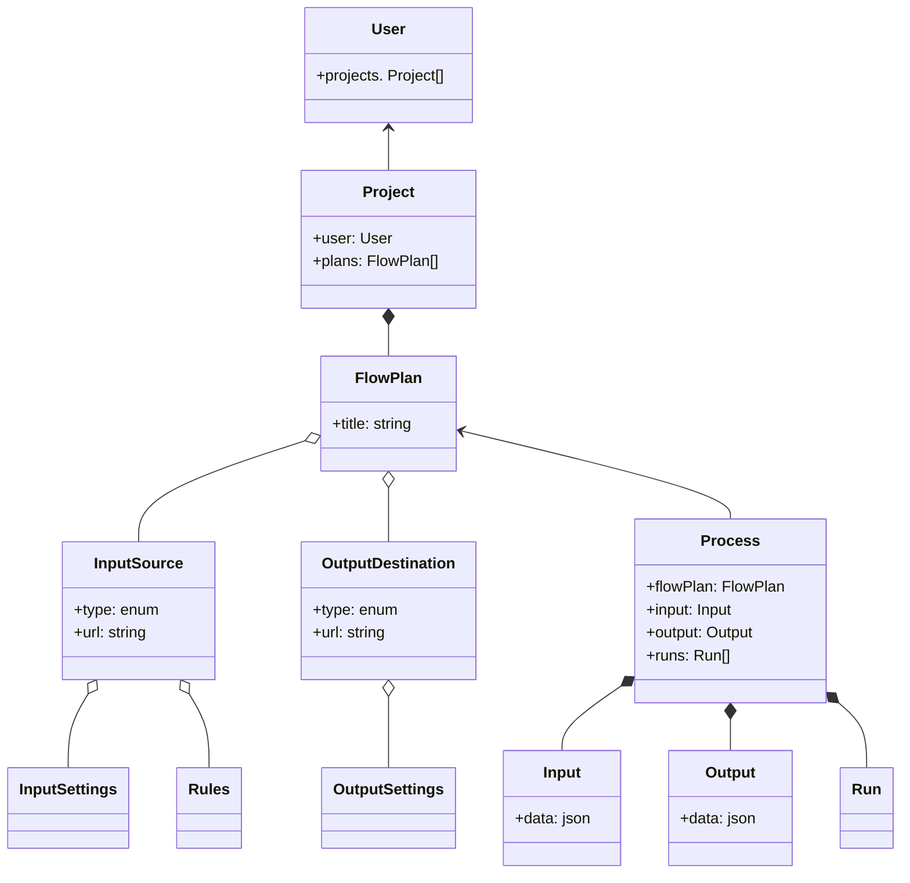

# UML Diagram

```mermaid
classDiagram

    class User{
      +projects. Project[]
    }


    class Project{
      +user: User
      +plans: FlowPlan[]
    }
    User <-- Project


    class FlowPlan{
      +title: string
    }
    Project *-- FlowPlan


    class InputSource{
      +type: enum
      +url: string
    }
    FlowPlan o-- InputSource


    class InputSettings{
    }
    InputSource o-- InputSettings


    class OutputDestination{
      +type: enum
      +url: string
    }
    FlowPlan o-- OutputDestination


    class OutputSettings{
    }
    OutputDestination o-- OutputSettings


    class Rules{
    }
    InputSource o-- Rules


    class Process{
      +flowPlan: FlowPlan
      +input: Input
      +output: Output
      +runs: Run[]
    }
    FlowPlan <-- Process


    class Input{
      +data: json
    }
    Process *-- Input


    class Output{
      +data: json
    }
    Process *-- Output


    class Run{
    }
    Process *-- Run

```
