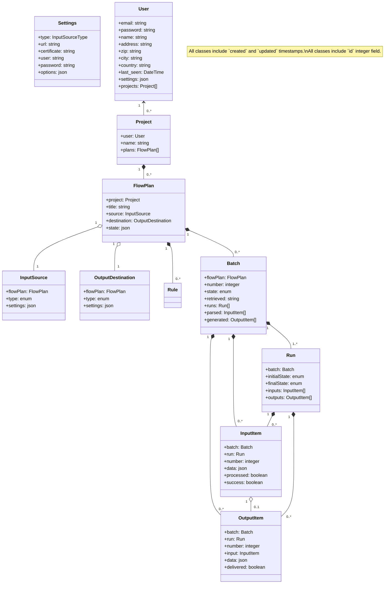

# UML Diagram

```mermaid
classDiagram

  note "All classes include `created` and `updated` timestamps.\nAll classes include `id` integer field."

    class Settings{
      +type: InputSourceType
      +url: string
      +certificate: string
      +user: string
      +password: string
      +options: json
    }

    class User{
      +email: string
      +password: string
      +name: string
      +address: string
      +zip: string
      +city: string
      +country: string
      +last_seen: DateTime
      +settings: json
      +projects: Project[]
    }


    class Project{
      +user: User
      +name: string
      +plans: FlowPlan[]
    }
    User "1" <-- "0..*" Project


    class FlowPlan{
      +project: Project
      +title: string
      +source: InputSource
      +destination: OutputDestination
      +state: json
    }
    Project "1" *-- "0..*" FlowPlan


    class InputSource{
      +flowPlan: FlowPlan
      +type: enum
      +settings: json
    }
    FlowPlan "1" o-- "1" InputSource


    class OutputDestination{
      +flowPlan: FlowPlan
      +type: enum
      +settings: json
    }
    FlowPlan "1" o-- "1" OutputDestination


    class Rule{
    }
    FlowPlan "1" *-- "0..*" Rule


    class Batch{
      +flowPlan: FlowPlan
      +number: integer
      +state: enum
      +retrieved: string
      +runs: Run[]
      +parsed: InputItem[]
      +generated: OutputItem[]
    }
    FlowPlan "1" *-- "0..*" Batch


    class InputItem{
      +batch: Batch
      +run: Run
      +number: integer
      +data: json
      +processed: boolean
      +success: boolean
    }
    Batch "1" *-- "0..*" InputItem


    class OutputItem{
      +batch: Batch
      +run: Run
      +number: integer
      +input: InputItem
      +data: json
      +delivered: boolean
    }
    Batch "1" *-- "0..*" OutputItem
    InputItem "1" o-- "0..1" OutputItem

    class Run{
      +batch: Batch
      +initialState: enum
      +finalState: enum
      +inputs: InputItem[]
      +outputs: OutputItem[]
    }
    Batch "1" *-- "1..*" Run
    Run "1" *-- "0..*" InputItem
    Run "1" *-- "0..*" OutputItem

```
